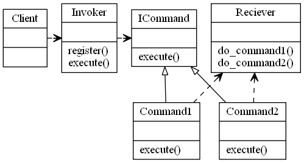

= _Command Pattern_

*When to use Command Pattern :*

- When you need to have an Undo feature within your application
- When you need to decouple the logic of the command away from the client
- You can think about it like having a remote which dose a single thing when you press a button
- Could be a problem where you don't know the client, and you just need to return the result to it as a blackbox
operation.
- Ideally used a third party kind of situations.

*UML :*

*About the example:*

- A calculator is a prime example of how to you command pattern there is a button to add, and a button to undo same goes
fo subtracting

*Problems with normal approach:*

1- Doing the normal approach can get messy when dealing with the undo operations
2- The logic of the commands maybe Interfering with the logic of the client code

*Notes about this pattern:*

- Invokers = Are the interface between client and command
- Adding a new command is as simple as adding the "CommandNameCommand" in the Commands Dir with do and undo
- Clients are added within the clients dir

*Useful Readings*

https://sourcemaking.com/design_patterns/command

