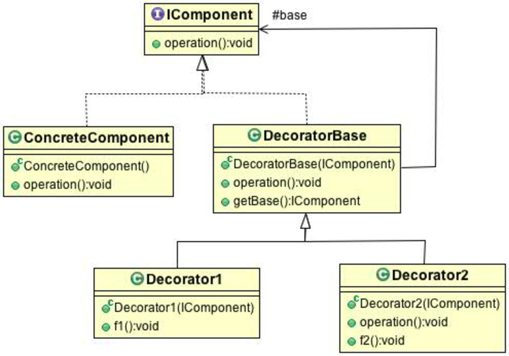

= _Decorator Pattern_

*When to use Decorator Pattern :*

- When you need to add behaviour in run time
- When you have a lot of sub classes that dose the same functions but with different values

*UML :*

*About the example:*

- Let's imagine that we have a pizza store that allows you to add toppings to your pizza.

*Problem of inheritance approach:*

1- there would many ways to impalement every possible combination of pizza.

2- there would be too many sub classes with and without toppings.

3- if a topping price change, or you would try to add more description you will need
to go through every class.

*Notes about this pattern:*

- Decorator base class is of type "BaseComponentInterface"
- Each Decorator will have the same functions of "BaseComponentInterface"

*Useful Readings*

https://sourcemaking.com/design_patterns/decorator
