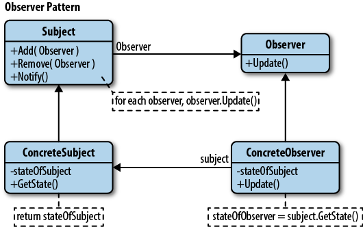

= _Observer Pattern_

*When to use Observer Pattern :*

- When you need have a lot of objects that are inserted in a data that is being updated in an object
- When you need to use pushing data instead of polling data for every short amount of time

*UML :*

*About the example:*

- Let's imagine that we have a weather station that updates the weather data for some devices like a phone and wall based
display.

*Problems with normal approach:*

1- there would create a problem when all related objects needs to read the data at the same time.

2- there would be a problem determining how often to pull the data from the object.

3- there can be a delay using polling data.

4- there can be a problem when pulling data if the data is updated while reading.

*Notes about this pattern:*

- Observable is the thing that has interesting data "ObservableInterface"
- You can send the updated data through the update function
- Otherwise you can have an "ObservableInterface" inside the "Observer" so that you can access the data
- Push Push Vs Poll Pull approch

*Useful Readings*

https://sourcemaking.com/design_patterns/observer

