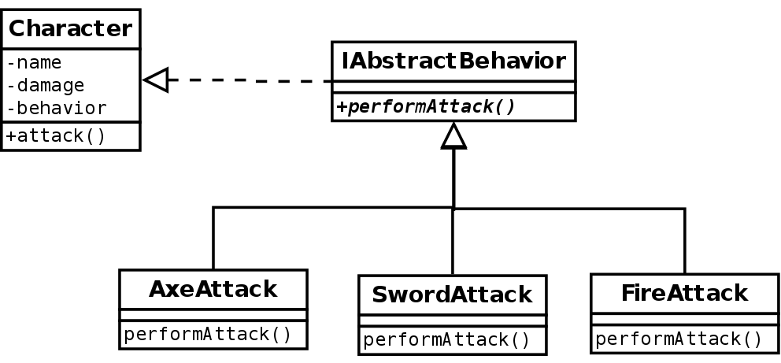

= _Strategy Pattern_

*When to use Strategy Pattern :*

- When you need to share behaviours between classes on the same level of inheritance not from up to down but horizontally
- When you need the same behaviour to change across sub classes

*UML :*

*About the example:*

- Let's imagine that we have a duck with sub classes (Mountain and wild and rubber) which can fly and run and quack.

*Problems with normal approach:*

1- there would create a problem when you need to have for example rubber duck now you have a duck that can't quack, so
the idea could be that you just override the quack function but that could lead to breaking liskov substation law.

2- maybe you need to add some sort of special behaviour to a certain fly or something this would lead to repeated code

3- There would be a lot of complicated functions and not very robust code

*Notes about this pattern:*

- Behaviours = Strategies and Ducks = Clients (Client is the class that uses the strategy)
- Adding a new strategy is as simple as adding the "StrategyInterface" or "StrategyClass" itself
- This pattern leads to think about the system as composition(Has a) instead of inheritance(Is a)
- This pattern can revel that you don't need sub-classes for example you can inject the behaviour itself in the function
using this example (quack(new NormalQuack())) you don't need to have a special type of duck (Sub classes of ducks)
for this the only difference in this the quack itself you can have only one duck class, and inject the behaviour
- Think (Has A) instead of (Is A)

*Useful Readings*

https://sourcemaking.com/design_patterns/strategy

